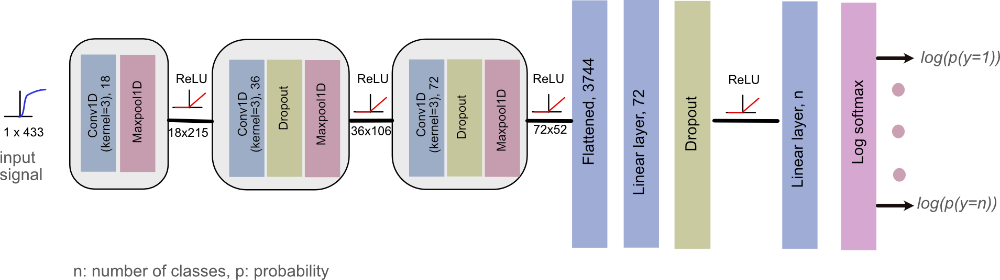

# HSI Analysis ML
Deep learning and machine learning methods for hyper-spectral imaging data

**Contributor:** Dr. Sharib Ali <shairb.ali@eng.ox.ac.uk>

**Collaborator:** Dale Waterhouse <d.waterhouse@ucl.ac.uk>

#### Requirements
-  Miniconda
-  Linux/Unix only
-  pyTorch >1.5
-  CUDA > 10.0
-  scikit-learn
-  matplotlib
-  datatable

### Setup
- [Install miniconda](https://docs.conda.io/projects/conda/en/latest/user-guide/install/)
- Run `bash initial_setup.sh`

#### Data
- Both training and test data are provided in the `data` folder
- Training data and test data for noExclusion and balanced datasets

#### Results
- Computed results are also included in `metrics_outputs` folder as `.json file` produced from the provided codes
- `noExclusion` dataset (Table 2, Supplementary Tables 2-3) and `balanced` dataset (Supplementary Tables 4-6)

#### Training and testing classical machine learning approaches

- To reproduce Supplementary Tables 2 and Table 3, please run:
`bash Supplementary_Table2_Table3.sh`

- To reproduce Supplementary Tables 5 and Table 6, please run:
`bash Supplementary_Table5_Table6.sh`

**RESULTS SAVED IN:** `results_Classical_ML folder`

Includes:
- KNN
- SVM (with rbf kernel set)

#### Training a deep learning model
- For 3-way and 2-way 1D CNN classsification

	`bash script_train.sh`

 
#### Testing a deep learning model 
*Note: please train the model before running this, seeds are allocated for reproducibility*

- To reproduce table 2 in original manuscript, please run:
	`bash Table2.sh`

**RESULTS SAVED IN:** `results_noExlusion_test_data* folder`

- To reproduce table 4 in supplementary manuscript, please run:
	`bash Supplementary_Table4.sh`

**RESULTS SAVED IN:** `results_balanced_test_data* folder`

**Note:** Use of pytorch with CUDA is recommended to obtain 1D-CNN results reported in the paper.

*If you find any inconsistencies in results or code then please report to* [Sharib Ali](sharib.ali@eng.ox.ac.uk)

